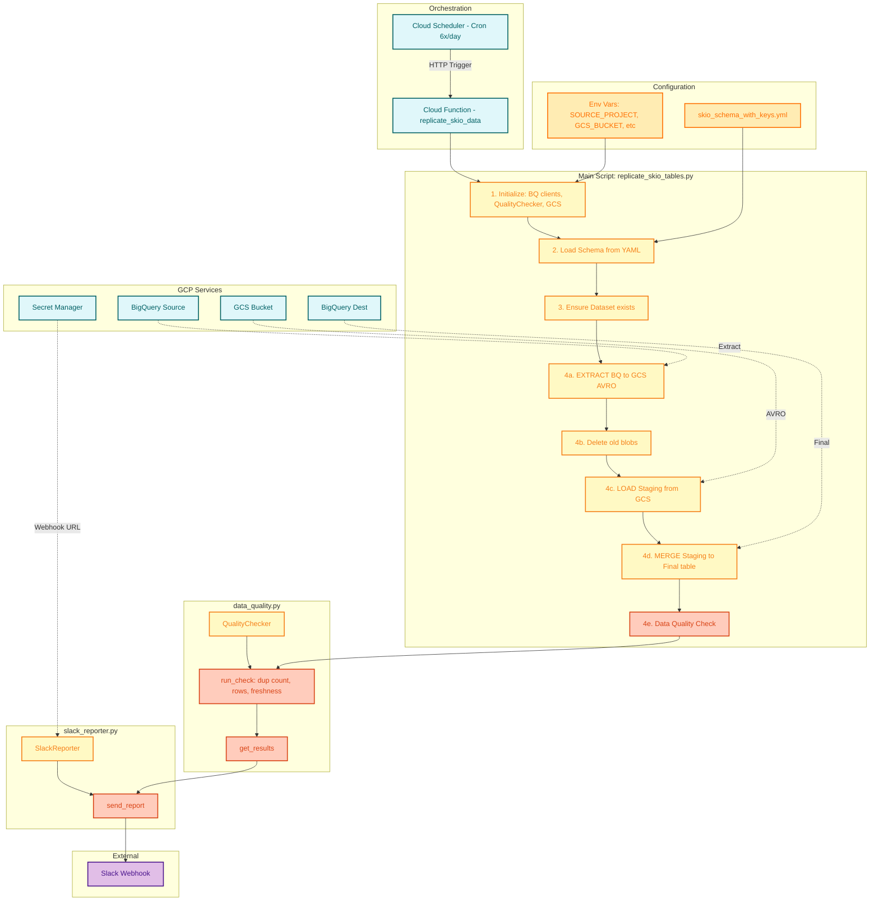
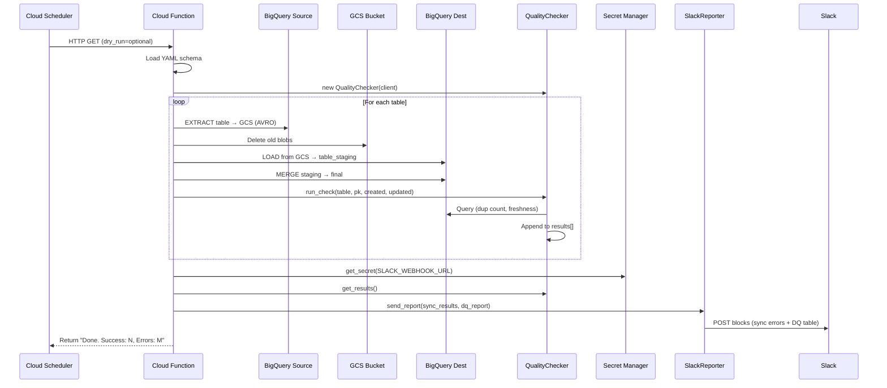

# Skio Replication Pipeline — Infrastructure Diagram

```mermaid
flowchart TB
    %% Styles
    classDef default fill:#fff,stroke:#333,stroke-width:2px,color:#333;
    classDef cloud fill:#e0f7fa,stroke:#006064,stroke-width:2px,color:#006064;
    classDef config fill:#ffecb3,stroke:#ff6f00,stroke-width:2px,color:#ff6f00;
    classDef process fill:#fff9c4,stroke:#f57f17,stroke-width:2px,color:#f57f17;
    classDef external fill:#e1bee7,stroke:#4a148c,stroke-width:2px,color:#4a148c;
    classDef alert fill:#ffccbc,stroke:#d84315,stroke-width:2px,color:#d84315;

    %% Orchestration
    subgraph Orchestration["Orchestration"]
        CS["Cloud Scheduler - Cron 6x/day"]:::cloud
        CF["Cloud Function - replicate_skio_data"]:::cloud
        CS -->|HTTP Trigger| CF
    end

    %% Configuration
    subgraph Config["Configuration"]
        YAML["skio_schema_with_keys.yml"]:::config
        ENV["Env Vars: SOURCE_PROJECT, GCS_BUCKET, etc"]:::config
    end

    %% Main Script
    subgraph Main["Main Script: replicate_skio_tables.py"]
        INIT["1. Initialize: BQ clients, QualityChecker, GCS"]:::process
        LOAD_SCHEMA["2. Load Schema from YAML"]:::process
        ENSURE_DS["3. Ensure Dataset exists"]:::process
        EXTRACT["4a. EXTRACT BQ to GCS AVRO"]:::process
        GCS_CLEAN["4b. Delete old blobs"]:::process
        LOAD_STG["4c. LOAD Staging from GCS"]:::process
        MERGE["4d. MERGE Staging to Final table"]:::process
        DQ_CHECK["4e. Data Quality Check"]:::alert
        INIT --> LOAD_SCHEMA --> ENSURE_DS --> EXTRACT
        EXTRACT --> GCS_CLEAN --> LOAD_STG --> MERGE --> DQ_CHECK
    end

    %% Data Quality
    subgraph DQ["data_quality.py"]
        QC["QualityChecker"]:::process
        QC_RUN["run_check: dup count, rows, freshness"]:::alert
        QC_GET["get_results"]:::alert
        QC --> QC_RUN --> QC_GET
    end

    %% Slack Reporting
    subgraph Slack["slack_reporter.py"]
        SR["SlackReporter"]:::process
        SEND["send_report"]:::alert
        SR --> SEND
    end

    %% GCP Services
    subgraph GCP["GCP Services"]
        BQ_SRC["BigQuery Source"]:::cloud
        BQ_DEST["BigQuery Dest"]:::cloud
        GCS_BUCKET["GCS Bucket"]:::cloud
        SM["Secret Manager"]:::cloud
    end

    %% External
    subgraph External["External"]
        SLACK["Slack Webhook"]:::external
    end

    %% Connections
    CF --> INIT
    YAML --> LOAD_SCHEMA
    ENV --> INIT
    DQ_CHECK --> QC_RUN
    QC_GET --> SEND
    SEND --> SLACK

    BQ_SRC -.->|Extract| EXTRACT
    GCS_BUCKET -.->|AVRO| LOAD_STG
    BQ_DEST -.->|Final| MERGE
    SM -.->|Webhook URL| SR
```

---

## Sequence Diagram: End-to-End Execution Flow

```mermaid
sequenceDiagram
    participant CS as Cloud Scheduler
    participant CF as Cloud Function
    participant BQ_SRC as BigQuery Source
    participant GCS as GCS Bucket
    participant BQ_DEST as BigQuery Dest
    participant QC as QualityChecker
    participant SM as Secret Manager
    participant SR as SlackReporter
    participant Slack as Slack

    CS->>CF: HTTP GET (dry_run=optional)
    CF->>CF: Load YAML schema
    CF->>QC: new QualityChecker(client)

    loop For each table
        CF->>BQ_SRC: EXTRACT table → GCS (AVRO)
        CF->>GCS: Delete old blobs
        CF->>BQ_DEST: LOAD from GCS → table_staging
        CF->>BQ_DEST: MERGE staging → final
        CF->>QC: run_check(table, pk, created, updated)
        QC->>BQ_DEST: Query (dup count, freshness)
        QC->>QC: Append to results[]
    end

    CF->>SM: get_secret(SLACK_WEBHOOK_URL)
    CF->>QC: get_results()
    CF->>SR: send_report(sync_results, dq_report)
    SR->>Slack: POST blocks (sync errors + DQ table)
    CF-->>CS: Return "Done. Success: N, Errors: M"
```