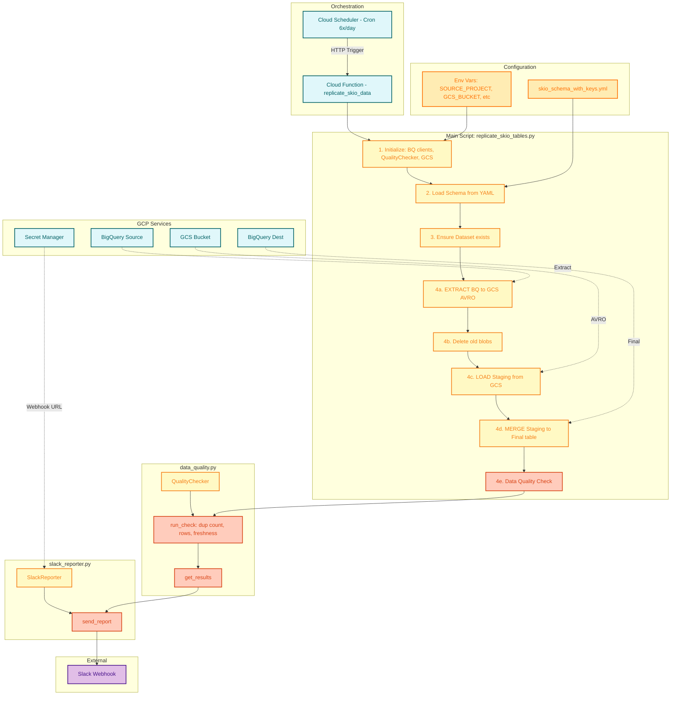
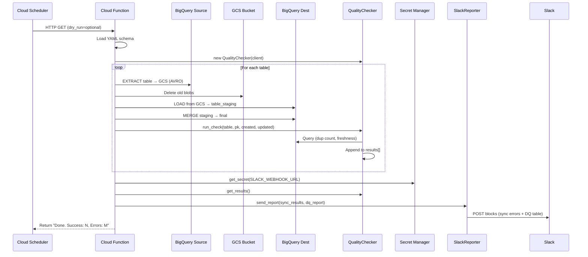
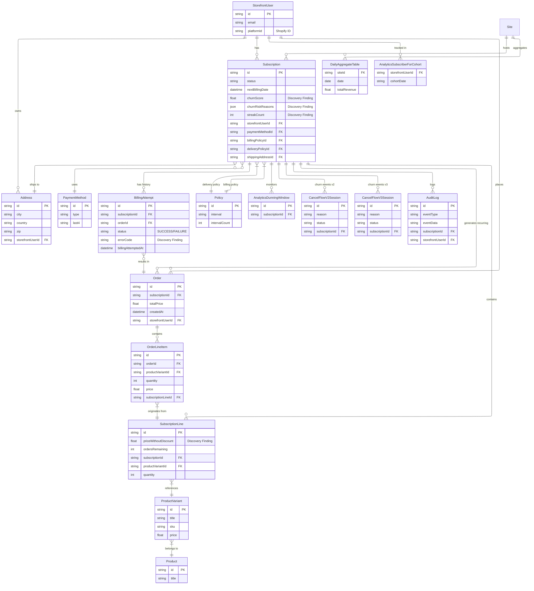

# Skio Replication Pipeline — Infrastructure Diagram

---

## Sequence Diagram: End-to-End Execution Flow

---

## Database model

[Live view of the model on mermaid live](https://mermaid.live/edit#pako:eNrFWFtv4jgU_itWpJmn0gVK2y1vLLRSta22gumMtOLFTQ7Bi2NnbaedTNv_vsfOhQAGMt2VloeqOZz7-c4lvAahjCAYBp1OZy5CKRYsHs4FIZzmMjNDAnw1F-5LUBNGY0UT-zUhnz6RsVRAroVhhoEuqDODtIWSwjxqUOTtrdORr2SWPelQsdQwKciQzIMl1fPgkMQfKsIHy5pyGsIR7lEUKdDa8csXseZmBvb7ILXxck4o4_kojhXE1MAX-sTBCdCKVEvVmdhQPgGDGqqENL_xuHLHRKEdc49iDd-bgu-y03l7Iw80T0CYezBLGTmpTINfojT1G-OciXhkDCSpqXJPlkxjInO_rbfCluQszJ3EU6GEpI7UUigCzp5B5QelirCa5dNLlmpi5E6KC0TcsQWEecihoBfEJmZsPm8x2OM53UFaDIhxW16iIMyUwpArwa00ln6vRdH9jBtNmNjx-0HJKAsNuadpajXuOOIQUOWvYP5KFaPClKoXoEA0emAzzlLSiympWMyECwl7JqkUbFnZtF1UHLgUsbcOI0F5blioyWcyBYNwRIv701uzTzIhMP5vTETyxRlJpGCIwoPVGVOMnN9w-fK1P0OMVM0bLjMlCDyjeU2e-y1VnO1XcXZIxSiLmLmTsZPjMj42jqqYS11PoG6kGsulVEV6jaLhCqISLl5VrwXVfrSxUCQsIg-_71AhwVmzQ8WhaRZSJbcRWpstZcoWObmdVG6_z30Va2tSG2oyvSZHCDDDEiACvpuyUyZIW3MsuKSGuITPQrs05sGE6VC6-XCDiGi0mv38pdEdxz5lejUFis_6mBBDKKOHQFdjmeH_R9jrYJppx3zd7AacNseun6UckcX887NUA_EQj51-dkqUE7HBVJesGDqta9Uo8JbJoihGGsofFAvBU9AQs2kgGpn2afNCyw2koy4XDqXWl28MU50ZV8AWtbSllzYvemr7QdRztl0mqjJvjMUtHmvi74zaYyffinRrOfwHpSk5XEh7gOJ60Db343h8PZv9cjO6vXucXnsQDkrZ4RMd7bq67E8bAa3rX0e8eYe0DdjkKewQOdVmsKW-ugfaKg7rmjSJFjhql_6DpR9Ac3nYtPUI0QLqmfJN_FRUN5-2DZTbt3UymamOoG0d1V7_gKpmTlaZtzV946g-RtqaPIDsn-xCr3d7usy56Sluvd5bL117NHzxwdl9g8uPfqDdj6PQdw219Vm5LXp0mR_21ufJ2f_ryZ4D819O4V31vlvu9UPnROiE1xdSbcv34ukxga-qW4rt5HZ_vNt9akGZVcaCkyBWLAqGRmVwEiSgcGPiY-As4W26hATmgXuFo2plF4SVSan4U8qkElMyi5fBcEG5xqcstcbLnwdqFhDY5G7WBcMrpyEYvgbfg-FgcHXavRpcdK9-vez1u93zkyAPhuf900G3e9kf9Hv93sX7SfDD2eud9s57lxe9_tXZoNfrnw9QFUT2xeG--OXC_YDx_g8ym2cv)

